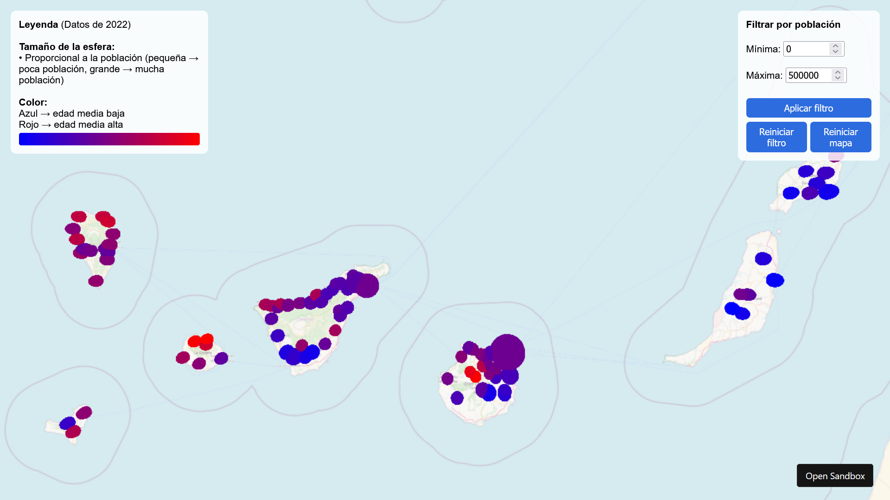

# Semana 8 - Terrenos y mapas geográficos
Proyecto interactivo en three.js que muestra un mapa de Canarias con información demográfica por municipio mediante esferas en 3D. Cada esfera representa un municipio y su tamaño, color y posición codifican diferentes variables poblacionales. Enlace del [CodeSandbox](https://codesandbox.io/p/sandbox/ig2526-s8-forked-t8l3jw).

Video demostración: [Mapa-demo-Mario.mp4](Mapa-demo-Mario.mp4)

## Descripción
La aplicación carga un mapa de Canarias en 3D sobre el que se colocan esferas que representan cada municipio, utilizando un sistema de coordenadas basado en latitud y longitud reales.

Cada esfera contiene tres tipos de información:
- Tamaño: proporcional a la población del municipio.
- Color: gradiente azul → rojo en función de la edad media (jóvenes → azul, mayores → rojo).
- Posición: mapeada a su ubicación geográfica real.

Los datos se obtienen de dos ficheros CSV:
1. municipios.csv: nombre, geocode, latitud y longitud.
2. indicadores_demograficos_municipios.csv: población, edad media, densidad...

La visualización incluye:
- Sistema de interacciones con el ratón (tooltip al pasar por un municipio).
- Filtros por población (mínima y máxima).
- Botón para reiniciar filtros.
- Botón para reiniciar la vista del mapa.

## Controles e interacción
Interacción básica:
- **Mover el ratón**: al pasar sobre un municipio se muestra un panel flotante con información del municipio.
- **Zoom**: rueda del ratón.
- **Desplazar cámara**: click derecho + arrastrar (rota desactivada).

Panel de filtros:
- Población mínima.
- Población máxima.
- Botones para reiniciar el filtro y la posición del mapa.

## Referencias
- [Documentación three.js](https://threejs.org/manual/#en/creating-a-scene)
- Datos obtenidos de:
  - [Municipios](https://datos.gob.es/en/catalogo/a05003423-municipios-de-canarias-delimitaciones-territoriales-para-fines-estadisticos-valido-hasta-2007)
  - [Datos población](https://datos.canarias.es/catalogos/estadisticas/dataset/d2fd1aef-2228-4072-917c-f511eeeadc80/resource/343a77f8-c987-43a1-b717-47248720358b?filters=date%3A2022-01-01%7Cdate%3A2022-01-01)
- Uso de IA:
  - Resolver errores surgidos al leer csv y al manejar los datos.
  - Ayuda para modificar las esferas.
