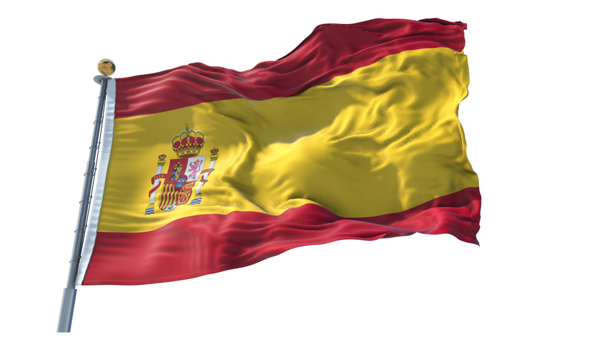
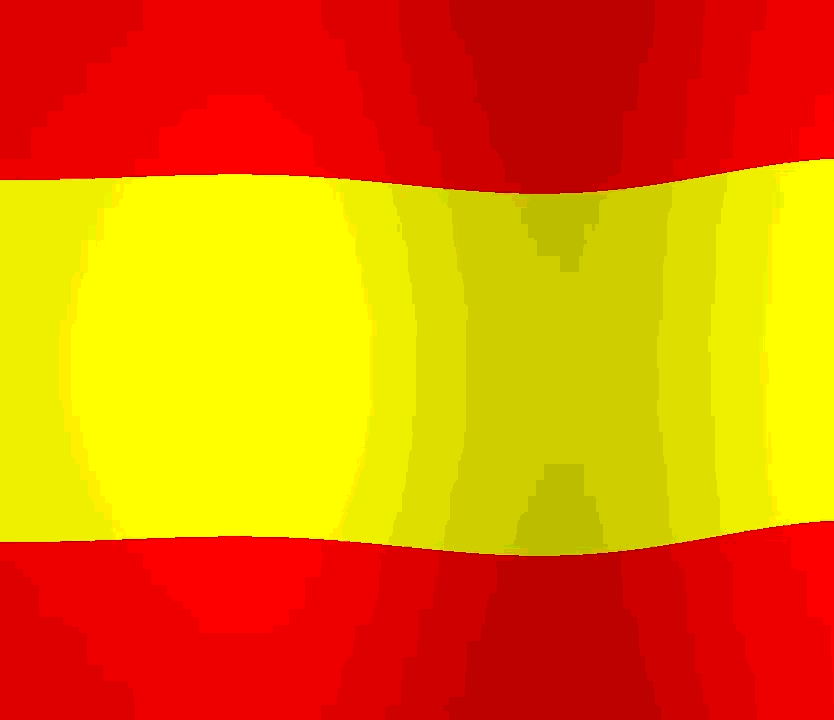

# Semana 9 - Shaders

## Motivación
El objeivo era crear una representación visual de la bandera de España, con un efecto de ondulación realista que simule el movimiento de la tela con el viento. Al conseguir esta ondulación, fueron surgiendo más añadidos que mejoraban la escena. Primero se hizo que la bandera ondulara menos por un lado, simulando el lado en el que está colgada. Finalmente, se añadieron sombras e iluminación que mejoran mucho el aspecto del shader.



La elección de la bandera de España como tema permitió comenzar con una geometría muy simple (3 franjas horizontales de color) para más tarde ir aprendiendo y añadiendo más detalles, como la deformación o el sombreado que añaden realismo.

## Descripción
Lo primero que se añadió fueron las 3 franjas de colores, para crear la bandera simple. Esto se hizo dividiendo el espacio vertical en tres sectores, haciendo el central el doble de ancho.
```
    vec3 color;
    if (uv.y < 0.25) {
        color = vec3(1.0, 0.0, 0.0);	// rojo
    } else if (uv.y < 0.75) {
        color = vec3(1.0, 1.0, 0.0);	// amarillo
    } else {
        color = vec3(1.0, 0.0, 0.0);	// rojo
    }
```

Lo siguiente fue añadir el efecto de ondulación, que se consiguió generando una onda sinusoidal. Esta onda tiene su `frecuency`, `amplitude` y su `speed` para poder modificarla fácilmente. Como quedaba muy simple, también añadí la línea `wave *= st.x;`, que añade mucho haciendo que la bandera ondee más en cuando más alejada del margen izquierdo está.

```
    // Onda base
    float amplitude = 0.03;
    float frequency = 8.0;
    float speed = 2.0;
    float wave = sin(st.x * frequency + u_time * speed) * amplitude;
    wave *= st.x;

    vec2 uv = st;
    uv.y += wave;
```

Para dar el toque final, se añadieron efectos de iluminación. Primero una sombra en las partes más deformadas por la onda y después un efecto que simula una fuente de luz focal.
```
    // Sombreado basado en la deformación
    float shade = wave * 8.0;
    color *= 1.0 - shade;

    // luz
    float spot = 1.0 - length(st - vec2(0.3, 0.5));
    spot = max(spot, 0.0);
    color *= 0.7 + spot * 0.3;
```

El resultado final es un shader que usa técnicas matemátias para mostrar la bandera de España con un efecto que hace parecer que está ondeando al viento.



## Versión Tiny Code
También está disponible el shader en [versión tiny code](code/espna-tiny.frag), que reduce en gran medida el tamaño del shader manteniendo la funcionalidad completa.

## Recursos
- Shader realizado en [thebookofshaders](http://editor.thebookofshaders.com/)
- Uso de IA para pasar el shader normal a tiny code.